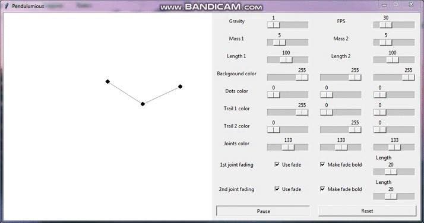

# Pendulumious
### A program for visualizing the famous physical system

  

## Table of contents
- [Usage and installation](#usage-and-installation)
- [Credits and references](#credits-and-references)
- [License](#license)

## Usage and installation
1. Upgrade required packages with `pip install -r requirements.txt --upgrade` (if you don't have one, it will be automatically installed).
2. Run the `main.py` with `python src/main.py`.

## Credits and references
- All the formulas were taken from [website of Massachusetts Institute of Technology](https://web.mit.edu/jorloff/www/chaosTalk/double-pendulum/double-pendulum-en.html).

## License
[Pendulumious](https://github.com/8nhuman8/pendulumious) specific code is distributed under [MIT License](https://github.com/8nhuman8/pendulumious/blob/master/LICENSE).

Copyright (c) 2020 Artyom Bezmenov
